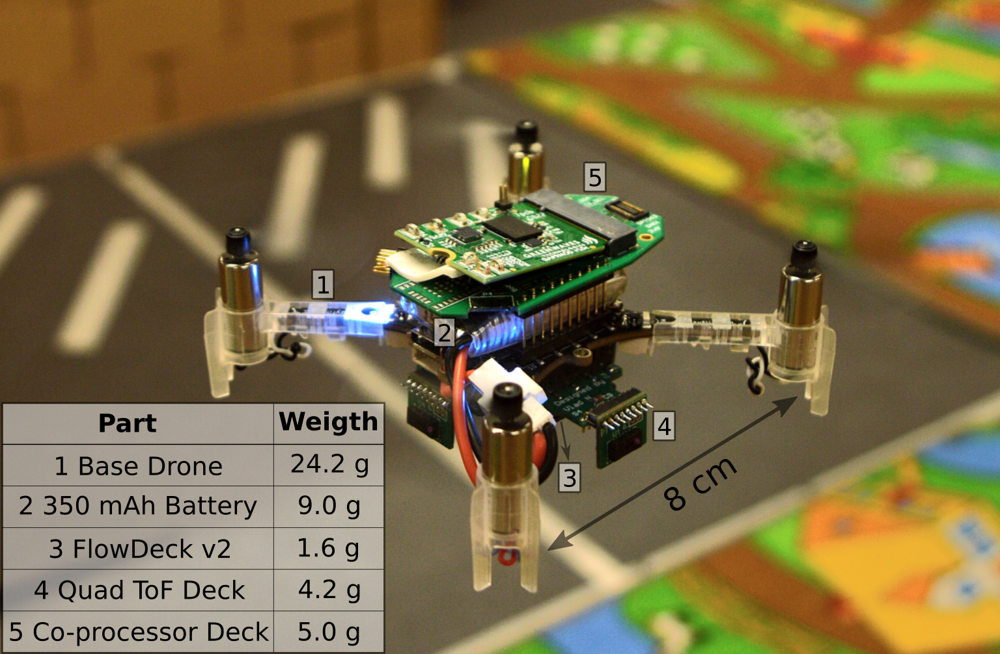

[![Contributors][contributors-shield]][contributors-url]
[![Forks][forks-shield]][forks-url]
[![Stargazers][stars-shield]][stars-url]
[![Issues][issues-shield]][issues-url]
[![License][license-shield]][license-url]

# NanoSLAM: Enabling Fully Onboard SLAM for Tiny Robots

**Authors: *Vlad Niculescu*, *Tommaso Polonelli*, *Michele Magno*, *Luca Benini*** 

Corresponding author: *Vlad Niculescu* <vladn@iis.ee.ethz.ch>  


## About the Project
Perceiving and mapping the surroundings are essential for autonomous navigation in any robotic platform. The algorithm class that enables accurate mapping while correcting the odometry errors present in most robotics systems is Simultaneous Localization and Mapping (SLAM). Today, fully onboard mapping is only achievable on robotic platforms that can host high-wattage processors, mainly due to the significant computational load and memory demands required for executing SLAM algorithms. For this reason, pocket-size hardware-constrained robots offload the execution of SLAM to external infrastructures. To address the challenge of enabling SLAM algorithms on resource-constrained processors, this paper proposes NanoSLAM, a lightweight and optimized end-to-end SLAM approach specifically designed to operate on centimeter-size robots at a power budget of only 87.9 mW. We demonstrate the mapping capabilities in real-world scenarios and deploy NanoSLAM on a nano-drone weighing 44 g and equipped with a novel commercial RISC-V low-power parallel processor called GAP9. The algorithm, designed to leverage the parallel capabilities of the RISC-V processing cores, enables mapping of a general environment with an accuracy of 4.5 cm and an end-toend execution time of less than 250 ms.

## Demonstration Video
Our video briefly explains how our system works and showcases **NanoSLAM** operating onboard a 44 g nano-drone. [**Video available here**](https://www.youtube.com/watch?v=XUSVLHJ87J0).

## Publications
If you use **NanoSLAM** in an academic or industrial context, please cite the following publications:

Publications: 
* *NanoSLAM: Enabling Fully Onboard SLAM for Tiny Robots* [IEEE IoT Journal](https://ieeexplore.ieee.org/stamp/stamp.jsp?tp=&arnumber=10343110)
* *Fully Onboard SLAM for Distributed Mapping with a Swarm of Nano-Drones* [arXiv preprint](https://arxiv.org/pdf/2309.03678.pdf)

```bibtex
@article{niculescu2023nanoslam,
  title={NanoSLAM: Enabling Fully Onboard SLAM for Tiny Robots},
  author={Niculescu, Vlad and Polonelli, Tommaso and Magno, Michele and Benini, Luca},
  journal={IEEE Internet of Things Journal},
  year={2023},
  publisher={IEEE}
}
```

```bibtex
@article{friess2023fully,
  title={Fully Onboard SLAM for Distributed Mapping with a Swarm of Nano-Drones},
  author={Friess, Carl and Niculescu, Vlad and Polonelli, Tommaso and Magno, Michele and Benini, Luca},
  journal={arXiv preprint arXiv:2309.03678},
  year={2023}
}
```
## Getting Started

This work was developed using the following hardware setup:
- The commercial nano-drone platform [Crazyflie 2.1](https://www.bitcraze.io/products/crazyflie-2-1/)
- The GAP9 parallel processor developed by Greenwaves Technologies and interfaced with our drone using the PCB introduced in [this work](https://ieeexplore.ieee.org/abstract/document/10137327)
- Our custom deck provided in this repo (*quad-tof-deck/*) which features four [VL53L5CX](https://www.st.com/resource/en/datasheet/vl53l5cx.pdf) sensors
- The commercial [Flow-Deck v2](https://www.bitcraze.io/products/flow-deck-v2/)

<p align="center">
  
</p>

## Building and Flashing the Software
1. Clone this repository:`git clone git@github.com:ETH-PBL/NanoSLAM.git`
2. Build and flash the STM32 MCU following the instructions from [here](https://github.com/ETH-PBL/NanoSLAM/tree/main/stm32-app)
3. Build and flash the GAP9 SoC following the instructions from [here](https://github.com/ETH-PBL/NanoSLAM/tree/main/gap9-app)

Running the code on GAP9 is required every time the drone boots. After the steps above are performed, the mission can started by:
1. Connect to the drone using the Crazyflie Client (can be installed from [here](https://github.com/bitcraze/crazyflie-clients-python)
2. Go to the *Parameters* tab
3. Set the parameter *cmds.ready* to 1

## Coming Soon
We understand that replicating our setup is non-trivial and we want to allow more users to use our code. Therefore, we will soon release a version of NanoSLAM that runs on a computer in C or through a Python binding. In this way, the NanoSLAM will be easy to integrate within other projects or even ported to embedded computers such as Xavier or Jetson. While the parallelization advantages offered by the GAP9 will be lost, it should still be faster compared to many existing alternatives.

<!-- MARKDOWN LINKS & IMAGES -->
<!-- https://www.markdownguide.org/basic-syntax/#reference-style-links -->

[contributors-shield]: https://img.shields.io/github/contributors/ETH-PBL/NanoSLAM.svg?style=flat-square
[contributors-url]: https://github.com/ETH-PBL/NanoSLAM/graphs/contributors
[forks-shield]: https://img.shields.io/github/forks/ETH-PBL/NanoSLAM.svg?style=flat-square
[forks-url]: https://github.com/ETH-PBL/NanoSLAM/network/members
[stars-shield]: https://img.shields.io/github/stars/ETH-PBL/NanoSLAM.svg?style=flat-square
[stars-url]: https://github.com/ETH-PBL/NanoSLAM/stargazers
[issues-shield]: https://img.shields.io/github/issues/ETH-PBL/NanoSLAM.svg?style=flat-square
[issues-url]: https://github.com/ETH-PBL/NanoSLAM/issues
[license-shield]: https://img.shields.io/github/license/ETH-PBL/NanoSLAM.svg?style=flat-square
[license-url]: https://github.com/ETH-PBL/NanoSLAM/blob/master/LICENSE
[product-screenshot]: pics/drone.png
